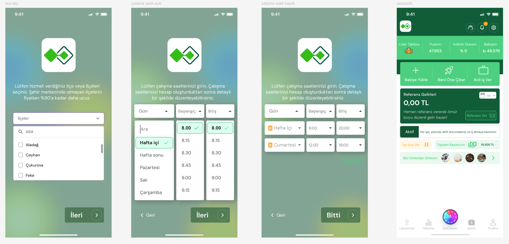

# Eterna Task – Front-End Development Showcase 🎯

This project was assigned to me during the recruitment process for a real-world front-end freelance position.

## 🔍 Task Description

The task was to develop an onboarding flow and homepage interface for a mobile-first app using React. The project included:

- 📍 Location selection screen with searchable dropdown
- ⏰ Work hour input with custom time pickers
- ✅ Multi-step form navigation
- 🏠 Mobile dashboard interface with summary statistics and actions

You can view the sample screens from the task below:

  

> ⚠️ This repository contains only task-specific code provided as part of the hiring process.

## 🛠️ Technologies Used

- React (CRA setup)
- Styled Components / Plain CSS
- Mobile-first responsive design
- Form handling & validation

## 🧠 What I Focused On

- Pixel-perfect implementation from design files
- Clean and reusable component structure
- UX-aligned layout flow
- Accessibility & responsiveness

## 📂 Project Structure

